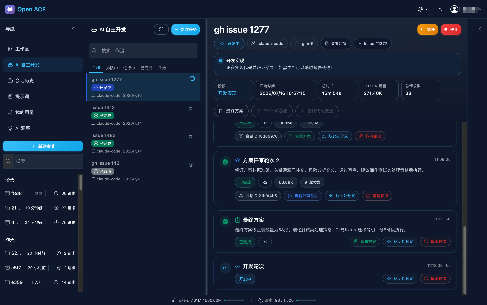
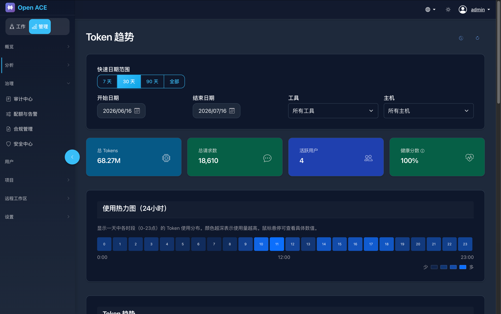

<p align="center">
  
</p>

<h1 align="center">Open ACE</h1>

<p align="center">
  <strong>AI Computing Explorer</strong><br>
  <em>企业级 AI 工作平台 · 让 AI 用得好、管得住</em>
</p>

<p align="center">
  <a href="#中文">中文</a> | <a href="#english">English</a>
</p>

<p align="center">
  
  
  
  
</p>

---

<a name="中文"></a>

## 🎯 这是什么？

**Open ACE** 是一个开源的**企业级 AI 工作平台**，解决企业在 AI 应用中的两大核心问题：

| 问题 | 解决方案 |
|------|----------|
| 🤔 **AI 用得好不好？** | Work 模式让员工高效使用 AI，提升生产力 |
| 😰 **AI 管得住管不住？** | Manage 模式让管理者全面掌控 AI 使用情况 |

## ✨ 两种模式，双重价值

### 🚀 Work 模式 — 让 AI 成为你的超级助手

> 面向每一位员工，提供流畅的 AI 交互体验

<p align="center">
  
</p>

**核心能力：**
- 🤖 **多 AI 工具集成** — 支持 Claude Code、Qwen Code、OpenClaw 等主流 AI，一个平台全搞定
- 💬 **智能对话管理** — 历史记录、会话恢复、上下文记忆，对话不中断
- 📝 **提示词库** — 团队共享优质提示词，最佳实践一键复用
- 🔍 **快速检索** — 跨会话搜索历史对话，知识沉淀不丢失

---

### 📊 Manage 模式 — 让 AI 治理有据可依

> 面向管理者，提供全方位的 AI 使用洞察与管控

<p align="center">
  
</p>

**核心能力：**
- 📈 **用量可视化** — Token 消耗趋势、成本分析、使用热力图，一目了然
- 🚨 **智能告警** — 配额预警、异常检测、超支提醒，风险早知道
- 📋 **合规审计** — 敏感内容检测、对话记录追溯、合规报告生成
- 👥 **多租户管理** — 部门隔离、权限控制、资源配额，精细化管理
- 💰 **ROI 分析** — 投入产出比、效率提升量化，让 AI 价值看得见

---

## 🏢 为什么选择 Open ACE？

| 特性 | 说明 |
|------|------|
| 🔒 **安全可控** | 私有化部署，数据不出域，满足企业安全合规要求 |
| 🌐 **多工具支持** | Claude Code、Qwen Code、OpenClaw... 一个平台管理所有 AI |
| 📊 **数据驱动** | 用量分析、成本优化、效率提升，用数据说话 |
| 🔌 **易于集成** | 支持 SSO 单点登录、飞书/钉钉集成，无缝融入现有体系 |
| 🐳 **一键部署** | Docker/K8s 支持，10 分钟完成私有化部署 |
| 🆓 **完全开源** | Apache 2.0 协议，自由使用、修改、分发 |

---

## 🚀 5 分钟快速开始

### 方式一：Docker 部署（推荐）

```bash
# 克隆项目
git clone https://github.com/open-ace/open-ace.git
cd open-ace

# 构建并启动（包含 PostgreSQL 数据库）
docker compose up -d --build

# 访问 http://localhost:5000
```

> 💡 生产环境部署请参考 [部署指南](scripts/install-central/docker-method/README.md)

### 方式二：源码安装

```bash
# 1. 克隆项目
git clone https://github.com/open-ace/open-ace.git
cd open-ace

# 2. 安装后端依赖
pip install -r requirements.txt

# 3. 安装前端依赖并构建
cd frontend && npm install && npm run build && cd ..

# 4. 初始化配置和数据库
python3 cli.py config init
python3 scripts/init_db.py

# 5. 启动服务
python3 web.py

# 访问 http://localhost:5000
```

### 默认账号

| 角色 | 用户名 | 密码 |
|------|--------|------|
| 管理员 | admin | admin123 |

> ⚠️ 生产环境请务必修改默认密码！

---

## 📖 功能详解

### 📊 数据分析

| 功能 | 描述 |
|------|------|
| 趋势分析 | 按日/周/月查看 Token 使用趋势 |
| 对比分析 | 不同时间段、不同工具的用量对比 |
| 热力图 | 使用高峰时段可视化 |
| 成本分析 | Token 消耗与成本换算 |

### 💬 消息追踪

| 功能 | 描述 |
|------|------|
| 对话历史 | 查看完整对话记录 |
| 消息搜索 | 按关键词、用户、时间筛选 |
| 会话导出 | 导出对话记录用于审计 |
| 时间线视图 | 可视化展示对话流程 |

### 🔔 告警中心

| 功能 | 描述 |
|------|------|
| 配额告警 | 用量达到阈值自动提醒 |
| 异常检测 | 识别异常使用模式 |
| 邮件通知 | 定期发送用量报告 |
| 飞书推送 | 实时告警推送到飞书群 |

### 👥 用户管理

| 功能 | 描述 |
|------|------|
| 多租户 | 支持多部门/团队隔离 |
| 角色权限 | 管理员/普通用户角色区分 |
| SSO 集成 | 支持企业单点登录 |
| 飞书同步 | 自动同步飞书组织架构 |

---

## 🛠️ 技术栈

<table>
<tr>
<td width="50%">

### 后端
- **Python 3.9+**
- **Flask** — Web 框架
- **SQLAlchemy** — ORM
- **PostgreSQL / SQLite** — 数据库
- **Alembic** — 数据库迁移

</td>
<td width="50%">

### 前端
- **React 18** — UI 框架
- **TypeScript** — 类型安全
- **Vite** — 构建工具
- **Bootstrap 5** — UI 组件
- **Chart.js** — 数据可视化

</td>
</tr>
</table>

---

## 📁 项目结构

```
open-ace/
├── web.py                 # Web 服务入口
├── cli.py                 # CLI 工具入口
├── app/                   # 后端应用
│   ├── routes/            # API 路由
│   ├── services/          # 业务逻辑
│   ├── models/            # 数据模型
│   └── repositories/      # 数据访问
├── frontend/              # 前端应用
│   ├── src/               # 源代码
│   └── package.json       # 依赖配置
├── scripts/               # 核心脚本
│   ├── fetch_*.py         # 数据收集
│   └── shared/            # 共享模块
├── docs/                  # 文档
└── tests/                 # 测试
```

---

## 📚 文档

| 文档 | 说明 |
|------|------|
| [架构说明](docs/ARCHITECTURE.md) | 系统架构与核心概念 |
| [部署指南](docs/DEPLOYMENT.md) | 本地与生产环境部署 |
| [开发指南](docs/DEVELOPMENT.md) | 参与开发 |
| [飞书配置](docs/FEISHU_CONFIG.md) | 飞书集成配置 |
| [API 文档](docs/API.md) | API 接口说明 |

---

## 🤝 贡献

我们欢迎所有形式的贡献！

- 🐛 发现 Bug？[提交 Issue](https://github.com/open-ace/open-ace/issues)
- 💡 有想法？[参与讨论](https://github.com/open-ace/open-ace/discussions)
- 🔧 想贡献代码？阅读 [贡献指南](CONTRIBUTING.md)

---

## 📄 许可证

本项目采用 [Apache 2.0](LICENSE) 许可证开源。

---

<p align="center">
  <strong>让 AI 的价值最大化，让 AI 的风险最小化</strong><br>
  <em>Open ACE — 您的 AI 治理专家</em>
</p>

---

<a name="english"></a>

## 🎯 What is This?

**Open ACE** is an open-source **Enterprise AI Work Platform** that solves two core challenges in enterprise AI adoption:

| Challenge | Solution |
|-----------|----------|
| 🤔 **Are we using AI effectively?** | Work Mode empowers employees to use AI efficiently and boost productivity |
| 😰 **Is AI under control?** | Manage Mode gives administrators full visibility and control over AI usage |

## ✨ Two Modes, Double Value

### 🚀 Work Mode — Make AI Your Super Assistant

> For every employee, providing a seamless AI interaction experience

<p align="center">
  
</p>

**Key Capabilities:**
- 🤖 **Multi-AI Integration** — Support for Claude Code, Qwen Code, OpenClaw and more — all in one platform
- 💬 **Smart Conversation Management** — History, session recovery, context memory — never lose a conversation
- 📝 **Prompt Library** — Share best practices across your team with reusable prompts
- 🔍 **Quick Search** — Search across all conversations, knowledge preserved

---

### 📊 Manage Mode — Data-Driven AI Governance

> For administrators, providing comprehensive AI usage insights and control

<p align="center">
  
</p>

**Key Capabilities:**
- 📈 **Usage Visualization** — Token consumption trends, cost analysis, heatmaps at a glance
- 🚨 **Smart Alerts** — Quota warnings, anomaly detection, overspending alerts — know risks early
- 📋 **Compliance Audit** — Sensitive content detection, conversation trails, compliance reports
- 👥 **Multi-tenant Management** — Department isolation, permission control, resource quotas
- 💰 **ROI Analysis** — Quantify AI value with ROI metrics and efficiency gains

---

## 🏢 Why Open ACE?

| Feature | Description |
|---------|-------------|
| 🔒 **Secure & Controllable** | Self-hosted deployment, data stays on-premise, meets enterprise compliance |
| 🌐 **Multi-tool Support** | Claude Code, Qwen Code, OpenClaw... manage all AI in one platform |
| 📊 **Data-Driven** | Usage analytics, cost optimization, efficiency gains — let data speak |
| 🔌 **Easy Integration** | SSO support, Feishu/DingTalk integration, seamless with existing systems |
| 🐳 **One-Click Deploy** | Docker/K8s support, deploy in 10 minutes |
| 🆓 **Fully Open Source** | Apache 2.0 license, free to use, modify, and distribute |

---

## 🚀 Quick Start in 5 Minutes

### Option 1: Docker (Recommended)

```bash
# Clone the project
git clone https://github.com/open-ace/open-ace.git
cd open-ace

# Build and start (includes PostgreSQL database)
docker compose up -d --build

# Visit http://localhost:5000
```

> 💡 For production deployment, see [Deployment Guide](scripts/install-central/docker-method/README.md)

### Option 2: From Source

```bash
# 1. Clone the project
git clone https://github.com/open-ace/open-ace.git
cd open-ace

# 2. Install backend dependencies
pip install -r requirements.txt

# 3. Install frontend dependencies and build
cd frontend && npm install && npm run build && cd ..

# 4. Initialize configuration and database
python3 cli.py config init
python3 scripts/init_db.py

# 5. Start the server
python3 web.py

# Visit http://localhost:5000
```

### Default Credentials

| Role | Username | Password |
|------|----------|----------|
| Admin | admin | admin123 |

> ⚠️ Please change the default password in production!

---

## 📖 Feature Details

### 📊 Analytics

| Feature | Description |
|---------|-------------|
| Trend Analysis | View token usage trends by day/week/month |
| Comparison | Compare usage across time periods and tools |
| Heatmap | Visualize peak usage hours |
| Cost Analysis | Convert token consumption to costs |

### 💬 Message Tracking

| Feature | Description |
|---------|-------------|
| Conversation History | View complete conversation records |
| Message Search | Filter by keyword, user, time |
| Session Export | Export conversations for audit |
| Timeline View | Visualize conversation flow |

### 🔔 Alert Center

| Feature | Description |
|---------|-------------|
| Quota Alerts | Automatic notifications when thresholds reached |
| Anomaly Detection | Identify unusual usage patterns |
| Email Reports | Periodic usage reports via email |
| Feishu Push | Real-time alerts to Feishu groups |

### 👥 User Management

| Feature | Description |
|---------|-------------|
| Multi-tenant | Department/team isolation |
| Role Permissions | Admin/user role distinction |
| SSO Integration | Enterprise single sign-on support |
| Feishu Sync | Auto-sync Feishu organization structure |

---

## 🛠️ Tech Stack

<table>
<tr>
<td width="50%">

### Backend
- **Python 3.9+**
- **Flask** — Web Framework
- **SQLAlchemy** — ORM
- **PostgreSQL / SQLite** — Database
- **Alembic** — Migrations

</td>
<td width="50%">

### Frontend
- **React 18** — UI Framework
- **TypeScript** — Type Safety
- **Vite** — Build Tool
- **Bootstrap 5** — UI Components
- **Chart.js** — Visualization

</td>
</tr>
</table>

---

## 📁 Project Structure

```
open-ace/
├── web.py                 # Web server entry
├── cli.py                 # CLI tool entry
├── app/                   # Backend application
│   ├── routes/            # API routes
│   ├── services/          # Business logic
│   ├── models/            # Data models
│   └── repositories/      # Data access
├── frontend/              # Frontend application
│   ├── src/               # Source code
│   └── package.json       # Dependencies
├── scripts/               # Core scripts
│   ├── fetch_*.py         # Data collection
│   └── shared/            # Shared modules
├── docs/                  # Documentation
└── tests/                 # Tests
```

---

## 📚 Documentation

| Document | Description |
|----------|-------------|
| [Architecture](docs/ARCHITECTURE.md) | System architecture and concepts |
| [Deployment](docs/DEPLOYMENT.md) | Local and production deployment |
| [Development](docs/DEVELOPMENT.md) | Contributing guide |
| [Feishu Config](docs/FEISHU_CONFIG.md) | Feishu integration |
| [API Reference](docs/API.md) | API documentation |

---

## 🤝 Contributing

We welcome all forms of contribution!

- 🐛 Found a bug? [Submit an Issue](https://github.com/open-ace/open-ace/issues)
- 💡 Have an idea? [Join the discussion](https://github.com/open-ace/open-ace/discussions)
- 🔧 Want to contribute code? Read the [Contributing Guide](CONTRIBUTING.md)

---

## 📄 License

This project is licensed under the [Apache 2.0 License](LICENSE).

---

<p align="center">
  <strong>Maximize AI Value, Minimize AI Risk</strong><br>
  <em>Open ACE — Your AI Governance Expert</em>
</p>